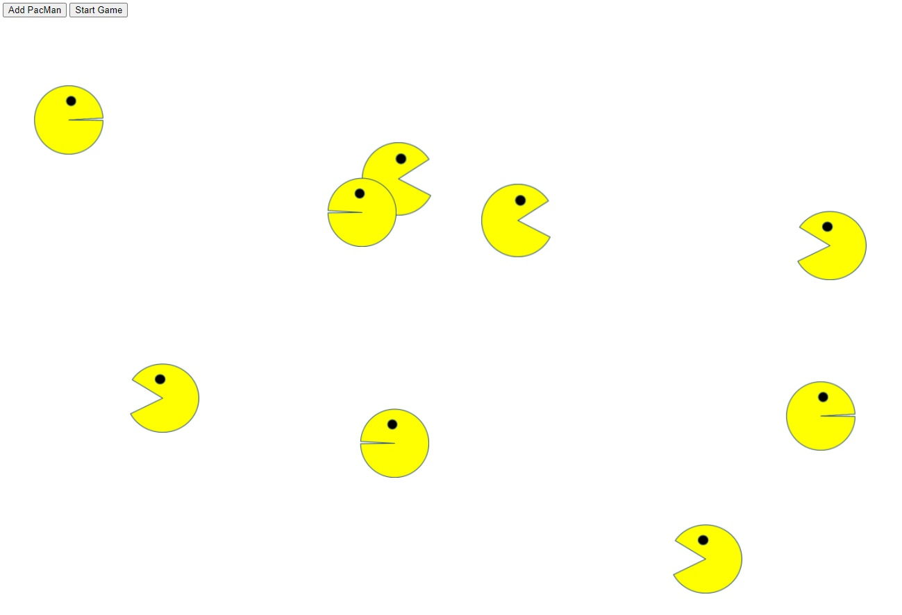

<div align="center" id="top"> 
  

  &#xa0;

  <!-- <a href="https://pacmen.netlify.app">Demo</a> -->
</div>

<h1 align="center">PacMen</h1>

<p align="center">
  

  

  

  

  <!--  -->

  <!--  -->

  <!--  -->
</p>

<!-- Status -->

<!-- <h4 align="center"> 
	🚧  PacMen 🚀 Under construction...  🚧
</h4> 

<hr> -->

<p align="center">
  <a href="#dart-about">About</a> &#xa0; | &#xa0; 
  <a href="https://gibranalcazar.github.io/PacMen/">Run!</a> &#xa0; | &#xa0;
  <a href="#white_check_mark-requirements">Requirements</a> &#xa0; | &#xa0;
  <a href="#checkered_flag-starting">Starting</a> &#xa0; | &#xa0;
  <a href="#memo-license">License</a> &#xa0; | &#xa0;
  <a href="https://github.com/gibranalcazar" target="_blank">Author</a>
</p>

<br>

## :dart: About ##

Most likely you have played the most famous video game of the 80's. Here is a small sample, I hope this web application brings you good memories!

## :sparkles: Run web app! ##

<brk>
<a href="https://gibranalcazar.github.io/PacMen" target="_blank">Link to PacMen</a>


## :white_check_mark: Requirements ##

Before starting :checkered_flag:, you need to have [Git](https://git-scm.com) installed.

## :checkered_flag: Starting ##

```bash
# Clone this project
$ git clone https://github.com/gibranalcazar/pacmen

# Access
$ cd pacmen


```

## :memo: License ##

This project is under license from MIT. For more details, see the [LICENSE](LICENSE) file.


Made with :heart: by <a href="https://github.com/gibranalcazar" target="_blank">Gibrán Alcázar</a>

&#xa0;

<a href="#top">Back to top</a>
